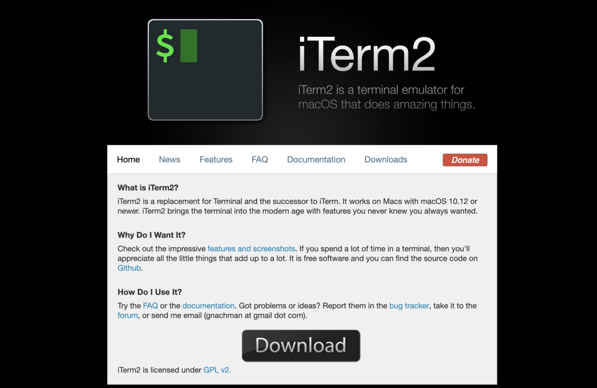

import PostGoals from 'components/Post/PostGoals'
import Emoji from 'components/_ui/Emoji/Emoji'

<PostGoals
    title="Goals"
    goals={[
        "⚒ Get to know the terminal, npm, a server, and our text editor",
        "🙏 Run the local server with our HTML/CSS/JS project"
    ]}
/>

In Part 1 of this tutorial, we will collect the tools needed to spin up and edit a website. By the end, you will have a local environment set up and the space needed to start working on a project. 👏

<br/>

## Who this is for
You might be a:
- Designer
- Data Scientist
- Web Developer
- Interested person at any skill level looking to create a website (Welcome! 🎉)

<br/>

<!-- This tutorial is broken down into three parts:
- **Part 1**: Setting up our environment and running a project locally in our browser (You are here! 🏁)
- **Part 2**: Committing our work to Github
- **Part 3**: Deploying to a public url with Netlify -->


We will be tackling a pure HTML, CSS, and vanilla JavaScript project - not any frontend frameworks like [React](https://reactjs.org/), [Vue](https://vuejs.org/), or [Angular](https://angular.io/). We'll save those for a rainy day.

Let's go! 🚀

<br/>
<br/>

### Tools and files

- Terminal: iTerm2 (optional)
- Node and npm
- Server: Live server
- Text editor: Visual Studio Code
- Sample project: HTML, CSS, and JavaScript files (Demo site)

<br/>

### Terminal commands used in this tutorial

make directory
```
mkdir [directory-name]
```
<br/>

change directory (moves your terminal a level deeper into a folder)
```
cd [folder-name]
```
<br/>

change directory (moves your terminal up a level)
```
cd ..
```


### Terminal: iTerm
*Feel free to skip installing iTerm2. Your default Terminal will work for this tutorial.*




    console.log("bananas");
    console.log("bees");

```js
export default ({ data, path }) => {
    let PostMarkdown = data.mdx
    let featuredImgFluid = PostMarkdown.frontmatter.featuredImage.childImageSharp.fluid
    return (
        <Layout className="PostMarkdown">
            <div>
                <h1>
                    {PostMarkdown.frontmatter.title}
                </h1>
                <div className="PostMarkdown__metas">
                    <div className="Post__date">
                        {PostMarkdown.frontmatter.date}
                    </div>
                    <div className="PostMarkdown__social">
                        <TwitterShareButton
                            url={`https://marguerite.io${path}`}
                            title={PostMarkdown.frontmatter.title}
                            className="PostMarkdown__social__share-button">
                            <span>
                                Tweet me!
                            </span>
                            <TwitterIcon
                                className="PostMarkdown__social__icon"
                                size={32}
                                round />
                        </TwitterShareButton>
                    </div>
                </div>
                <div className="PostMarkdown__intro">
                    {PostMarkdown.frontmatter.intro}
                </div>
                
                <MDXRenderer>{PostMarkdown.body}</MDXRenderer>
            </div>
        </Layout>
    )
}
```