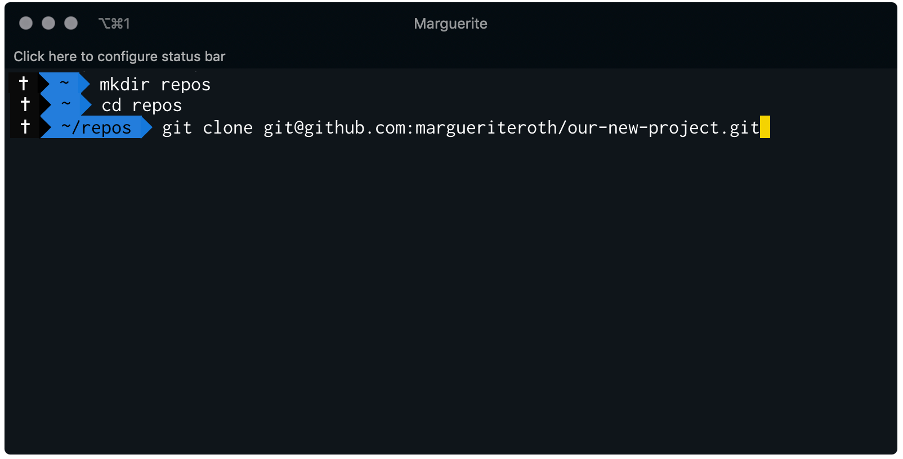
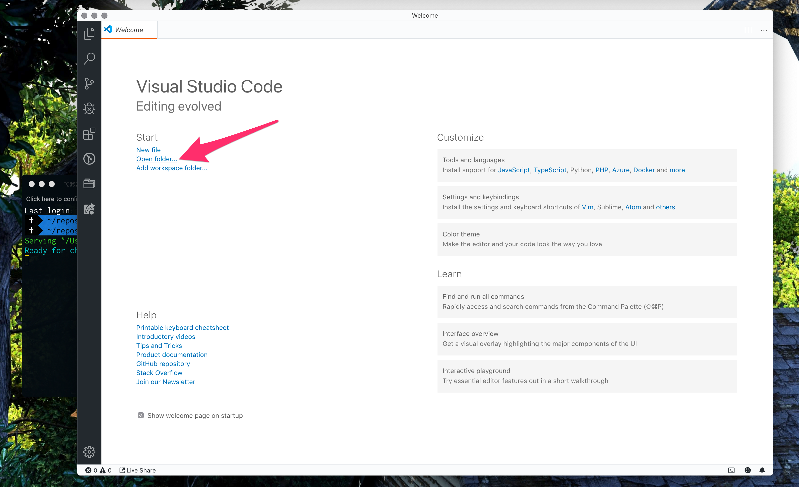
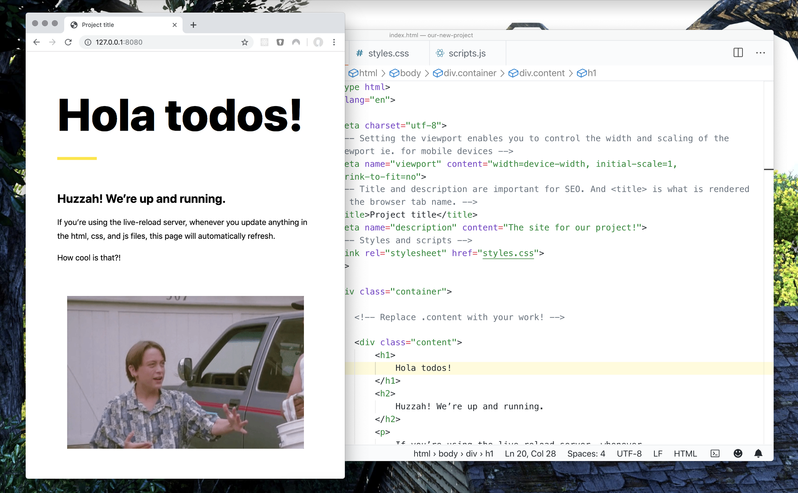

import PostGoals from 'components/Post/PostGoals'
import PostLinks from 'components/Post/PostLinks'
import PostNote from 'components/Post/PostNote'
import PostTOC from 'components/Post/PostTOC'
import Emoji from 'components/_ui/Emoji/Emoji'
import Link from 'components/_ui/Link/Link'

<PostTOC>
    <div className="PostTOC__item">
        Goals
    </div>
    <div className="PostTOC__item">
        Who this is for
    </div>
    <div className="PostTOC__item">
        Setting up tools and files
    </div>
    <div className="PostTOC__item">
        Walking through HTML, CSS, and JS files
    </div>
    <div className="PostTOC__item">
        Running our local environment
    </div>
    <div className="PostTOC__item">
        Editing the files
    </div>
    <div className="PostTOC__item">
        Now what?
    </div>
</PostTOC>

<PostLinks
    demo="https://sample.marguerite.io/"
    repo="https://github.com/margueriteroth/our-new-project"
/>

<PostGoals
    title="Goals"
    goals={[
        "⚒ Get to know the terminal, npm, a server, and our text editor",
        "🙏 Run the local server with our HTML/CSS/JS project"
    ]}
/>

In Part 1 of this tutorial, we will collect the tools needed to spin up and edit a website. By the end, you will have a local environment set up and the space needed to start working on a website, data visualization, or any other kind of web-based project. 👏

<br/>
<br/>

## Who this is for
You might be a:
- Designer
- Data Scientist
- Web Developer
- Interested person at any skill level looking to create a website (Welcome! 🎉)

<br/>

<!-- This tutorial is broken down into three parts:
- **Part 1**: Setting up our environment and running a project locally in our browser (You are here! 🏁)
- **Part 2**: Committing our work to Github
- **Part 3**: Deploying to a public url with Netlify -->


We will be tackling a pure HTML, CSS, and vanilla JavaScript project - not any frontend frameworks like [React](https://reactjs.org/), [Vue](https://vuejs.org/), or [Angular](https://angular.io/). We'll save those for a rainy day.

Let's go! 🚀

<br/>
<br/>

### Tools and files [add this to sidebar]

- Terminal
- Node and npm
- Server: Live server
- Text editor: Visual Studio Code
- Sample project: HTML, CSS, and JavaScript files (Demo site)

<br/>

### Terminal commands used in this tutorial [add this to sidebar]

make directory
```
mkdir [directory-name]
```
<br/>

change directory (moves your terminal a level deeper into a folder)
```
cd [folder-name]
```
<br/>

change directory (moves your terminal up a level)
```
cd ..
```

<br/>
<br/>
<br/>

### Terminal

If you've never used your terminal before, don't worry. We'll go over what the terminal is and commands needed for this tutorial.


Hey Marguerite, write about what a terminal is and why its awsm.

<br/>
<br/>
<br/>

### Node and npm


<br/>

[Node](https://nodejs.org/en/) is a run-time environment for JavaScript. I.E. it helps you execute JavaScript code.

You may already have Node installed. To check, open up your terminal, paste this command, and hit enter.

```
node -v
```

<br/>


<br/>

If Node is not installed, the terminal will say that Node is not found. Head to [nodejs.org](https://nodejs.org/en/), download the LTS version on the left, and follow the installation instructions. After installing, running the `node -v` command will return the Node version, verifying that Node is installed on your machine.

<br/>
<br/>
<br/>

### Server: Live Server

Live Server is an application that runs on your computer with the use of server software and it allows you to run your project's JavaScript code. Essentially, this mimics a server that your website will be deployed on once it's out on the internet.

[Live Server](https://www.npmjs.com/package/live-server) is a wonderful and free development server that comes with a hot reload capability (automatically refreshing your browser anytime a saved change is detected).

To install, run the following command in your terminal:

```
npm install -g live-server
```

<br/>

<PostNote>
    <p className="PostNote__content">
        If you are seeing permission errors, you may need to add <code>sudo</code> to the beginning of this command to grant admin access. <code>sudo</code> gives you super-user permission to modify your computer. This is common for those using macOS.
    </p>
    <Link
        className="PostNote__link"
        to="https://superuser.com/questions/185441/what-does-the-sudo-command-do"
        doOpenInNewTab
    >
        Read more about <i>sudo</i> here
    </Link>
</PostNote>

<br/>
<br/>

With our `sudo` friend:
```
sudo npm install -g live-server
```

<br/>
<br/>
<br/>

### Text Editor
_You may already have a text editor you prefer to use. Skip this section if you don't want to install VSCode._


<br/>

A text editor is a program that allows you to write and edit all the code for your project in a range of programming languages.

The text editor in this tutorial's screenshots is Visual Studio code.

I switched to using VSCode last year and like the large the large extension library and themes. (Regarding themes: I prefer light text editor themes as toggling between a light browser and dark editor causes eye strain for me. I am currently using the GitHub Plus theme, seen in the screenshots in this tutorial).

To install VSCode, head to (code.visualstudio.com)[https://code.visualstudio.com], download, and follow the installation instructions. 

Other editors:
- Sublime text
- Atom


<br/>
<br/>
<br/>

### Project and file organization

If this is your first dev project, I recommend keeping all project folders (future repos) organized in the same location. My repos are organized in a folder named _repos_ located in my User root folder.


<br/>

When you open a new terminal window, it will default your User root folder (for me that is margueriteroth). By having my repos folder here, I can easily navigate my terminal to the repos  folder and a project. I suggest keeping your projects in a similar spot. 

To create a new folder in your User root (your name) via the command line, open your terminal and make a repos folder:

```
mkdir repos
```

<br/>

Navigate inside your repos folder:

```
cd repos
```

<br/>

And copy (clone) the sample project:

```
git clone git@github.com:margueriteroth/our-new-project.git
```

<br/>
<br/>



<br/>

_If you are uncomfortable using terminal commands, create a `repos` folder and directly download the project files: https://github.com/margueriteroth/our-new-project/archive/master.zip._

<br/>

After downloading from github, the sample project will appear in your `repos` folder. Navigate your terminal into this new project folder:

```
cd our-new-project
```
<br/>

Here you will find our three project files: `index.html`, `styles.css`, and `scripts.js` (the README.md is only used for the github repo description. Feel free to ignore it!).

<br/>
<br/>
<br/>
<br/>

## Overview of the HTML, CSS, and JS files

<br/>

### index.html

The default page for sites is `index.html`. HTML stands for Hypertext Markup Language. A markup language is a set of instructions on how to create a document, like a webpage for your browser. Markdown is another type of markup language.

<PostNote isBlue>
    <p className="PostNote__content">
        HTML uses "markup" to annotate text, images, and other content for display in a Web browser. HTML markup includes special "elements" such as FILL THIS OUT
    </p>
    <Link
        className="PostNote__link"
        to="https://developer.mozilla.org/en-US/docs/Web/HTML"
        doOpenInNewTab>
        From the MDN web docs
    </Link>
</PostNote>

<br/>
<br/>
<br/>

### styles.css

CSS stands for Cascading Style Sheets and it is a styling language used to style the HTML elements (ie. element size, color, placement, font, etc.). Within a CSS file, you target DOM elements using ids, classes, tags, and style using CSS syntax. 

You may have seen CSS preprocessor files around: .less, .sass, and .scss, and a few others. Preprocessors are CSS-like language that compiles into CSS for use by a browser. They allow us to write CSS with less repetition and added functionally like mixins and color functions. 

To keep things simple, we are sticking with regular CSS for this tutorial.

<br/>
<br/>

### scripts.js

This is where our JavaScript lives. JavaScript is a client side scripting language used by your browser - it makes our static page intelligent (not to be confused with the Java programming language). With JavaScript, you can do things like complex interactions, calculations, and more. 

JQuery, Moment, and d3 are examples of common JavaScript libraries.

<br/>
<br/>
<br/>
<br/>

## Running the sample project

Now that we have installed all of our tools and downloaded the sample project, it is time to fire this baby up. 

Open your terminal and navigate from your User root folder to the project files folder.

```
cd our-new-project
```

<br/>

For the server to run our project, the server command needs to run while in the project folder, which we just navigated to in the step above. This is where our html, css, and js files live. Otherwise, the server won't know which files to serve.

Start the server 🔥

```
live-server
```

<br/>

A browser tab should automatically open at http://127.0.0.1:8080/.

<br/>


<br/>

_Weet woo!_


<br/>
<br/>
<br/>
<br/>

## Editing the files

Start VSCode and open the `our-new-project` folder. Your terminal is already running the `live-server` from this same folder location.

<br/>




<br/>

In `index.html` we have a basic html structure with our content inside of the `<body>` tag. To see hot reload in action, let's edit the `<h1>` and save.

<br/>




<br/>


. . . . . . . . . . .


<br/>
<br/>
<br/>
<br/>

## Now what?

The world is our oyster. Continue editing the project files!

Next steps / Resources

- Style the site
  - Utilize css [link to css tricks]
  - Add a css framework if you want an out-of-the-box solution [Bootstrap]


- Create a digital visualization
  - Add d3 to our site [link to starter with d3 chart]
  - D3 fundamentals [wattenberger]

