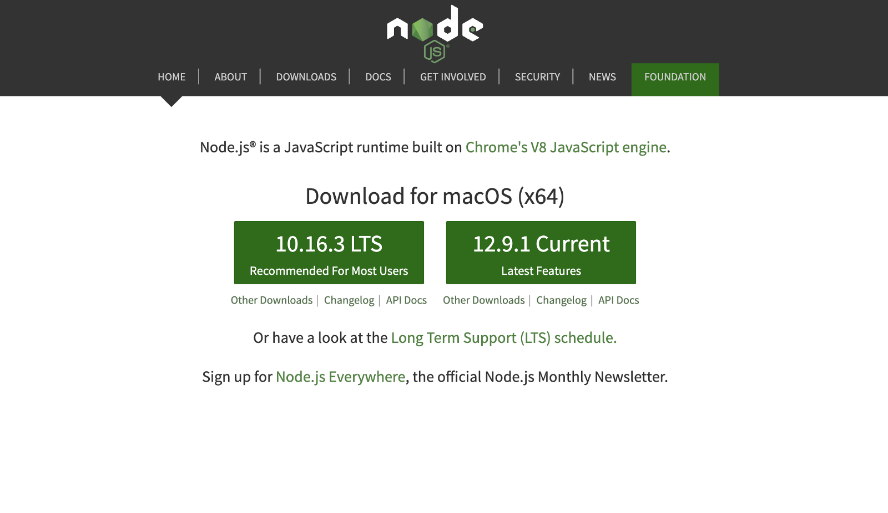
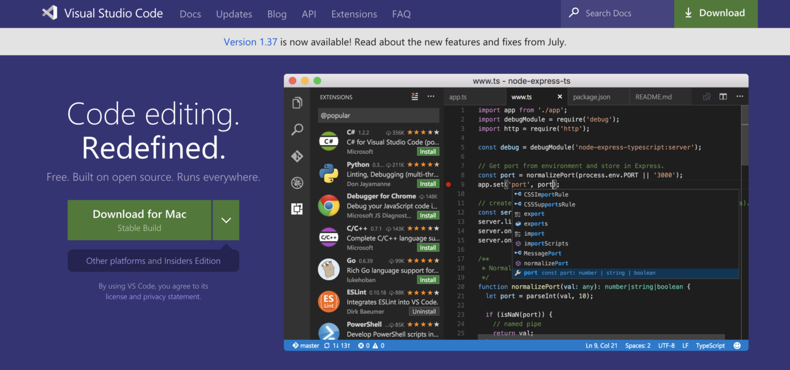
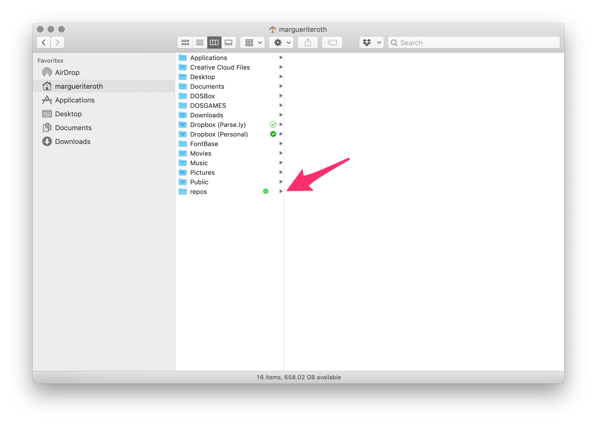
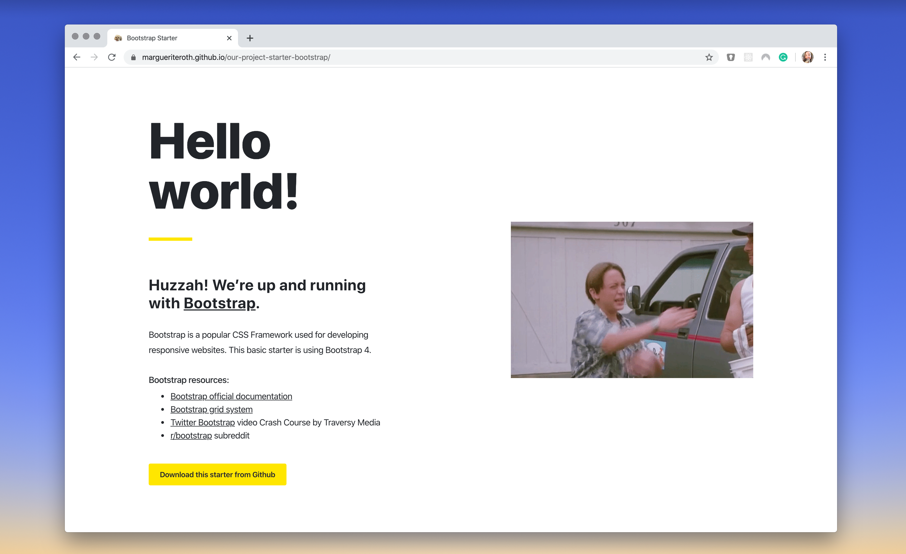

import PostNote from 'components/PostNote/PostNote'
import Link from 'components/_ui/Link/Link'

<!--
import PostLinks from 'components/Post/PostLinks'
import PostTOC from 'components/Post/PostTOC'
import Emoji from 'components/_ui/Emoji/Emoji'
-->

<br/>
<br/>

In Part 1 of this tutorial, we will collect and utilize the basic tools needed to spin up and edit a website. By the end, you will have a local environment set up and the workspace needed to start noodling on a website, data visualization, or any other kind of web-based project. 👏

#### You might be a:
- Designer
- Data Scientist
- Web Developer
- Interested person at any skill level looking to create a website

Welcome! 🎉

#### What you'll have running by the end of this post:

<br/>


<br/>


Note: We will be tackling a pure HTML, CSS, and vanilla JavaScript project—not any frontend frameworks like [React](https://reactjs.org/), [Vue](https://vuejs.org/), or [Angular](https://angular.io/). We'll save those for a rainy day.

Let's go! 🚀

<br/>

## Collecting tools and files

- Terminal
- Node and npm
- Live server
- Visual Studio Code
- Sample project I put together for you

<br/>

Don't worry if you've never used any of these tools before—I'll walk you through obtaining each one.

<br/>

<!-- ### Terminal commands used in this tutorial

- _add this to sidebar_

make directory
```
mkdir [directory-name]
```
<br/>

change directory (moves your terminal a level deeper into a folder)
```
cd [folder-name]
```
<br/>

change directory (moves your terminal up a level)
```
cd ..
```

<br/>
<br/> -->

### The terminal

Using your machine's terminal might look like the most daunting step to tackle, but it isn't! With a few basic commands we will use it get a project up and running in no time.


In a nutshell, the terminal (also known as the **command line**) is a way to interact with your computer. It is used to send commands to the computer like moving through files and folders, installing and running programs, creating and deleting documents, or anything else you do within your operating system. The command line used to be the _only_ way to interact with your computer—think back to MS-DOS!

Even though command line GUIs (graphical user interfaces aka programs) exist, terminals are still commonly used in development. I find that I can do tasks more quickly within the interface, whether that be navigating to a project and starting a server, using git, or running multiple environments at once. Since writing commands is like using a language, it gives me the freedom to express exactly I'm trying to do.

And it all comes with time. When I first began my journey into web development I only knew 1-2 commands and fudged my way through the rest. It is normal to make mistakes and google everything. Everyone does it.

<br/>

### Open your terminal

<br/>

**MacOS**: Finder -> Applications -> Utilities -> Terminal

**Windows**: Start -> All Programs -> Accessories -> Command Prompt

The images in this article show a MacOS environment and the iTerm terminal. The standard terminal that comes with your computer is fine to use.

<br/>

### Navigation commands used in this tutorial

Terminal commands will be shown in the following grey blocks with unicode text.

<br/>

**make directory** (Creates a folder aka directory. _Do not include the brackets when naming your directory._)
```
mkdir [folder-name]
```
<br/>

<br/>

**change directory** (Moves your terminal _down_ one level into a folder)
```
cd [folder-name]
```
<br/>

<br/>

**change directory** (Moves your terminal _up_ one level out of a folder)
```
cd ..
```
<br/>

<br/>

**list files** (Lists all files in the current directory)
```
ls
```

<br/>
<br/>


### Node and npm



<br/>

[Node](https://nodejs.org/en/) is a run-time environment for JavaScript. I.E. it helps execute JavaScript code. You may already have Node installed. To check, open up your terminal, paste this command, and hit enter.

```
node -v
```

<br/>


<br/>

If Node is not installed, the terminal will say that Node is not found. Head to [nodejs.org](https://nodejs.org/en/), download the LTS version on the left, and follow the installation instructions. After installing, running the `node -v` command will return the Node version, verifying that Node is installed on your machine.

<br/>
<br/>

### Live Server

Live Server is an application that runs on your computer with the use of server software and runs JavaScript code. Essentially, this mimics a production server for a website.

[Live Server](https://www.npmjs.com/package/live-server) is a wonderful and free development server that comes with a hot reload capability (automatically refreshing your browser anytime a saved change is detected).

To install, run the following command in your terminal:

```
npm install -g live-server
```

<br/>

<PostNote>
    <p className="PostNote__content">
        If you are seeing permission errors, you may need to add <code>sudo</code> to the beginning of this command to grant admin access. <code>sudo</code> gives you super-user permission to modify your computer. This is common issue for those using MacOS.
    </p>
    <Link
        className="PostNote__link"
        to="https://superuser.com/questions/185441/what-does-the-sudo-command-do"
    >
        Read more about <i>sudo</i> here
    </Link>
</PostNote>

<br/>
<br/>

_If_ you need to add `sudo`, the command will look like this:
```
sudo npm install -g live-server
```

<br/>
<br/>

### Text Editor
_You may already have a text editor you prefer to use. Skip this section if you don't want to install VSCode._



<br/>

A text editor is a program that allows you to write and edit all the code for your project in a range of programming languages.

The text editor used in this tutorial's screenshots is [Visual Studio Code](https://code.visualstudio.com). I switched to VSCode because I like the large the large extension library and themes it provides.

To install VSCode, head to [code.visualstudio.com](https://code.visualstudio.com), download, and follow the installation instructions. 

#### Other text editors:
- [Sublime text](https://www.sublimetext.com/)
- [Atom](https://atom.io/)


<br/>
<br/>

### Folder organization

If this is your first dev project, I recommend keeping all project folders organized in the same location. My project repos are organized in a folder called _repos_ located in my User root folder.



<br/>

A new terminal window will usually default your User root folder (for me that is "margueriteroth"). Having my _repos_ folder here lets me quickly point my terminal to that folder and to project. I suggest keeping your projects in a similar spot. 

To create a new folder in your User root (your name) via the command line, open your terminal and make a repos folder:

```
mkdir repos
```

<br/>

Navigate inside your repos folder (aka change directory! 🤪):

```
cd repos
```

<br/>
<br/>

### Clone the sample project

Once inside your _repos_ folder, copy (clone) the sample project:

```
git clone git@github.com:margueriteroth/our-project-starter.git
```

<br/>

_If you don't want to use the terminal for this, create a `repos` folder the way you normally create new folders and directly download and unzip the project files: https://github.com/margueriteroth/our-project-starter/archive/master.zip._

<br/>

Once cloned, the sample project will appear in your `repos` folder. Point your terminal into this new project folder:

```
cd our-project-starter
```
<br/>

Here you will find our three project files: `index.html`, `styles.css`, and `scripts.js` (the README.md is only used for the github repo description. Feel free to ignore it!).

<br/>
<br/>
<br/>

## Overview of the HTML, CSS, and JS files

<br/>

### index.html

The homepage page for a website is `index.html`. HTML stands for Hypertext Markup Language. A markup language is a set of instructions on how to create a document, like a webpage for your browser. Markdown is another type of markup language.


<PostNote isBlue>
    <p className="PostNote__content">
        HTML uses "markup" to annotate text, images, and other content for display in a Web browser. HTML markup includes special "elements".
    </p>
    <Link
        className="PostNote__link"
        to="https://developer.mozilla.org/en-US/docs/Web/HTML">
        See all elements in the MDN docs
    </Link>
</PostNote>


### styles.css

CSS stands for Cascading Style Sheets and it is a styling language used to style the HTML elements (ie. element size, color, placement, font, etc.). Within a CSS file, you target DOM elements using ids, classes, tags, and style using CSS syntax. 

You may have seen CSS preprocessor files around: .less, .sass, and .scss, and a few others. Preprocessors are CSS-like languages that compile into CSS to be used by a browser. They allow developers to write CSS with less repetition and added functionally like mixins and color functions. 

To keep things simple, we are sticking with vanilla CSS for this tutorial.

<br/>
<br/>

### scripts.js

This is where our JavaScript lives. JavaScript is a client side scripting language used by your browser—it makes our static page intelligent (not to be confused with the Java programming language). With JavaScript, you can create complex interactions, calculations, and more. 

[JQuery](https://jquery.com/), [Moment.js](https://momentjs.com/), and [D3.js](https://d3js.org/) are examples of common JavaScript libraries.

<br/>
<br/>
<br/>

## Running the sample project

Okay, the good part. Now that we have installed all the tools and downloaded the sample project, it is time to fire this baby up. 

Make sure the terminal is pointed to the project directory. If not, navigate to it:

```
cd our-project-starter
```

<br/>

For the server to run our project, the server command needs to run while while in the project folder, which we just navigated to in the previous step. Otherwise, it will try and run something else.

Start the server 🔥

```
live-server
```

<br/>

A browser tab should automatically open at http://127.0.0.1:8080/.

<br/>


_Weet woo!_


<br/>
<br/>
<br/>

## Editing the project

Start VSCode and open the `our-project-starter` folder. Your terminal is already running the `live-server` from this same folder location.

<br/>


<br/>

In `index.html` we have a basic html structure with our content inside of the `<body>` tag. To see hot reload in action, let's edit the `<h1>` and save.

<br/>


<br/>
<br/>
<br/>


Boom! The world is our oyster. Continue editing the project files.


## Additional starters

### D3.js

D3.js is a powerful JavaScript library used to produce dynamic, interactive data visualizations on the web.

#### D3.js starter:


<p className="Post__content__button-row">
    <Link doOpenInNewTab isButton to="https://margueriteroth.github.io/our-project-starter-d3/">
        D3 Starter Demo
    </Link>
    <Link doOpenInNewTab isButton buttonProps={{category: "secondary"}} to="https://github.com/margueriteroth/our-project-starter-d3">
        Download from Github
    </Link>
</p>

#### Awesome D3.js resources:
- [Fullstack D3](https://www.newline.co/fullstack-d3) book by Amelia Wattenberger
- [How to Learn D3.js](https://wattenberger.com/blog/d3) article by Amelia Wattenberger
- [D3 Block](https://bl.ocks.org/) examples, originally created by Mike Bostock
- [Interactive Data Visualization for the Web](https://alignedleft.com/work/d3-book-2e) book by Scott Murray


<br/>
<br/>
<br/>

### CSS Frameworks

CSS frameworks provide a basic structure for designing consistent responsive layouts, elements, and functionality for the web. A main benefit is  they provide a complete toolkit at the onset of a project and you don't have to write custom styles if you don't want to.

[Chris Coyier has a great article](https://css-tricks.com/what-are-the-benefits-of-using-a-css-framework/) about the pros and cons to using a CSS framework.

#### [Twitter Bootstrap](https://getbootstrap.com/) starter:



<p className="Post__content__button-row">
    <Link doOpenInNewTab isButton to="https://margueriteroth.github.io/our-project-starter-bootstrap/">
        Bootstrap Starter Demo
    </Link>
    <Link doOpenInNewTab isButton buttonProps={{category: "secondary"}} to="https://github.com/margueriteroth/our-project-starter-bootstrap">
        Download from Github
    </Link>
</p>

#### Twitter Bootstrap resources:
- [Bootstrap official documentation](https://getbootstrap.com/)
- [Bootstrap grid system](https://getbootstrap.com/docs/4.0/layout/grid/)
- [Twitter Bootstrap](https://getbootstrap.com/docs/4.0/layout/grid/) video Crash Course by Traversy Media
- [r/bootstrap](https://www.reddit.com/r/bootstrap/) subreddit

#### Other common frameworks:
- [Tailwind](https://tailwindcss.com/)
- [Foundation](https://foundation.zurb.com/)


<br/>
<br/>
<br/>

That's it! Let me know how it goes and don't hesitate to reach out if you have any questions.
