import Emoji from 'components/_ui/Emoji/Emoji'
import Link from 'components/_ui/Link/Link'

## The problem

In our Content Analytics platform currently, there is no concrete place that shows a user what data they do and do not have access to, nor communicates to them that more historical data is available outside their plan's tier.

Common data retention plans have retention trail of one or two years, but many customers have been with us for much longer. We collect data the moment a customer account successfully integrates Parse.ly's tracker, but depending on their plan, account's are only permitted access to a trailing amount of days.

###### Original datepicker
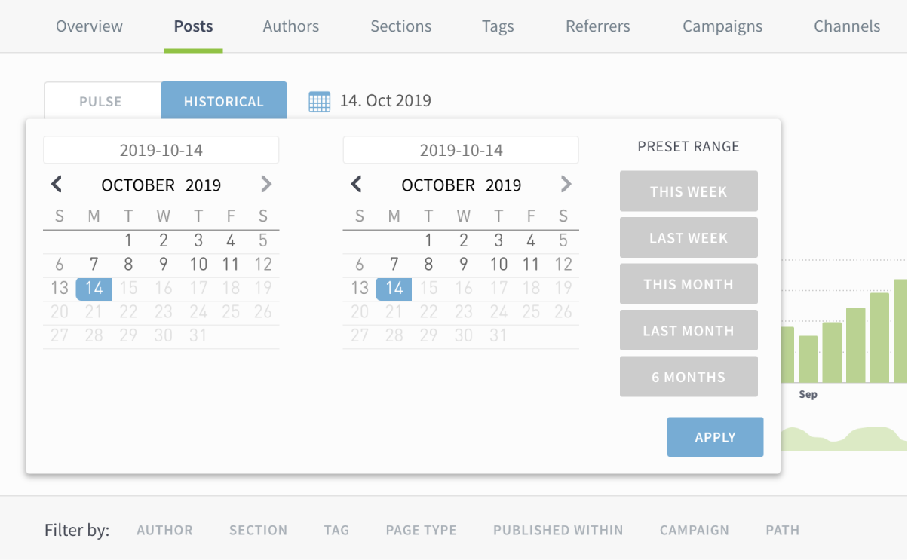

In the datepicker, we need to communicate if upgradable data exists, what historical range is included, and how to upgrade. Additionally, there needs to be UX flows for both admins and non-admins.

<!--
Additionally, additional event tracking is part of this release to better inform us of better historical date feature information. -->

## Research

To kick things off, I began by researching various in-app upsell prompts. Thanks to a [great article by Appcues](https://www.appcues.com/blog/upselling-prompts-saas), I used and modified their upsell categories and broke down various product examples:

- Moments of discovery
- Triggered when a feature is needed
- Free and premium features shown side-by-side
- Combined upsell messages
- Upsells added to regular workflows
- Messaging tailored to Power Users
- Prompts communicating a relative value metric
- Account status pages

##### Based on [_The 9 best upselling prompts for B2B SaaS companies_](https://www.appcues.com/blog/upselling-prompts-saas) by Katryana Balboni

 
 

###### Figma file with product examples
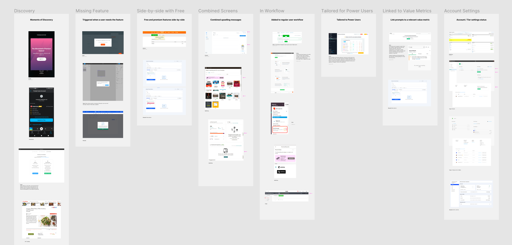

###### Examples: Mixpanel (Free and premium side-by-side), Mailchimp (Combined upsell messages)
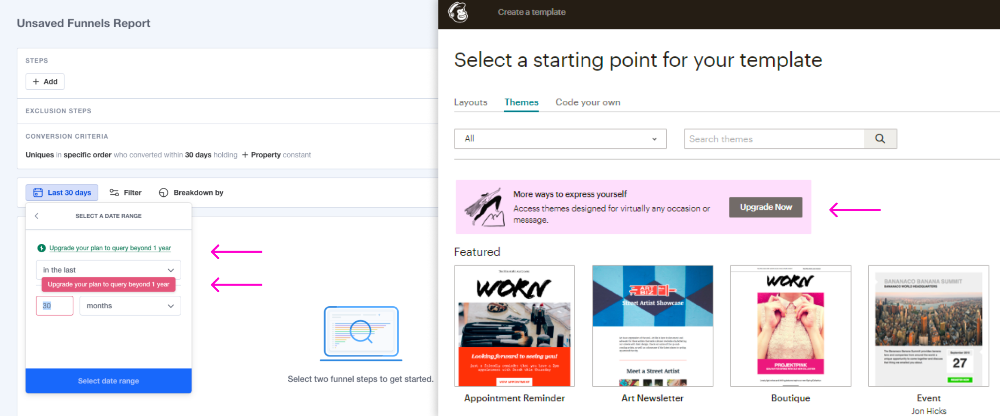

## Sketching and decision making

After collecting information, I started working through issues and potential solutions via pen and paper.

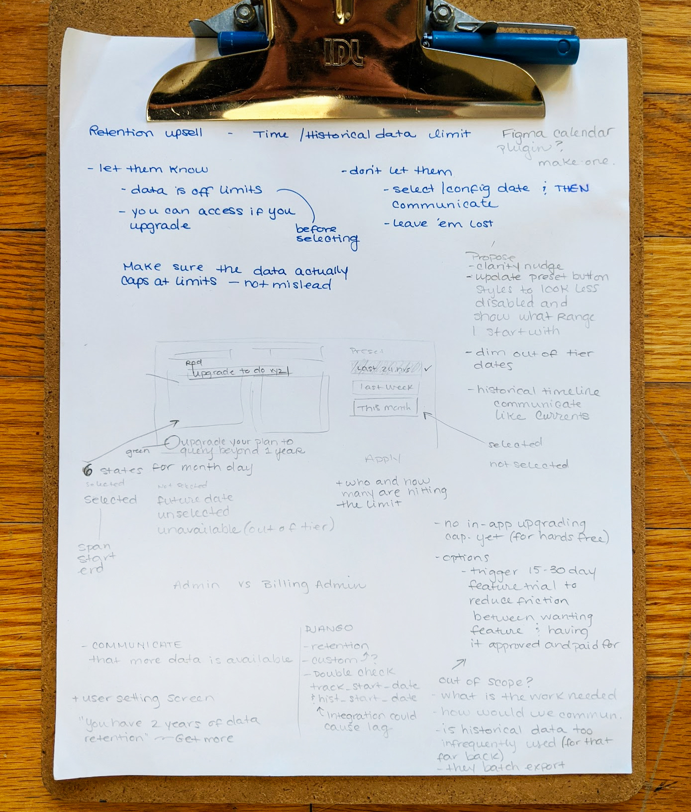

Starting with the original datepicker, I determined I need to:

- Update the current datepicker UI elements (calendar, inputs, presets) to allow for extra styles needed for various unselected and selected date states
    - Unselected date states:
        - Day outside the range of their minimum start date (before they  integrated the [Parse.ly](http://parse.ly) tracker)
        - Day is upgradable (historical data exists, but an upgraded plan is required)
        - Day is within their data retention range
        - Day is a future date (no data exists because it is the future 🔮)
    - Selected date states:
        - Day is the start-date of the selected range
        - Day is the end-date of the selected range
        - Day falls between the start and end date (aka a span-date)
- If upgradable data exists, surface a friendly button in the open datepicker that prompts the user to Upgrade (this also communicates that we have more than one year of historical data, for example)
    - Open an Upgrade Modal* when the user clicks the button above. If they are an admin, allow them to send a message to our sales team or if they are not an admin, bring them to their setting screens that lists apikey admins
- Track events around acount, user admin status, and user email address when the Upgrade button is clicked. This allows us to both begin upsell conversations and note the amount of users within an account who request access to deeper historical data (which becomes actionable data within upsell conversations)

 

##### * Because there is no self-serve account upgrade flow within the application, I opted to use a modal->message flow for the time being. Immediately upgrading within the app is preferred, but building out that functionality was out of the scope of this feature. It would also introduce additional complexities around user admin statuses—we want everyone to know if upgradable data exits, regardless of them being the account decision makers.

## Mockups and prototypes

#### Datepicker cleanup:

###### Original datepicker

###### Proposed datepicker cleanup
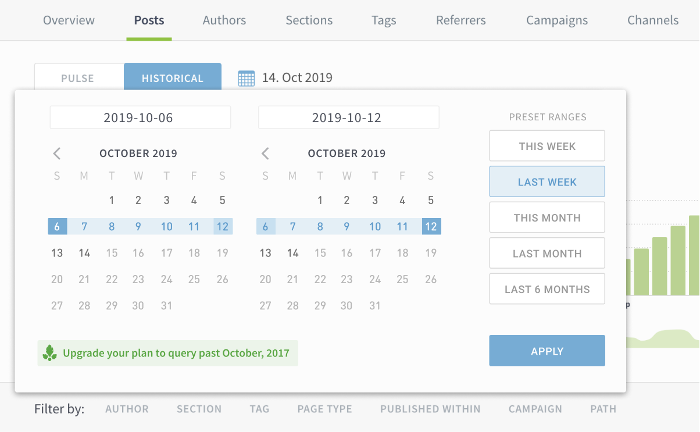

This cleanup addresses:
- Updating UI for both calendars, days, and presets
- Adds Upgrade button

#### Upgradable date ranges:

###### Option 1
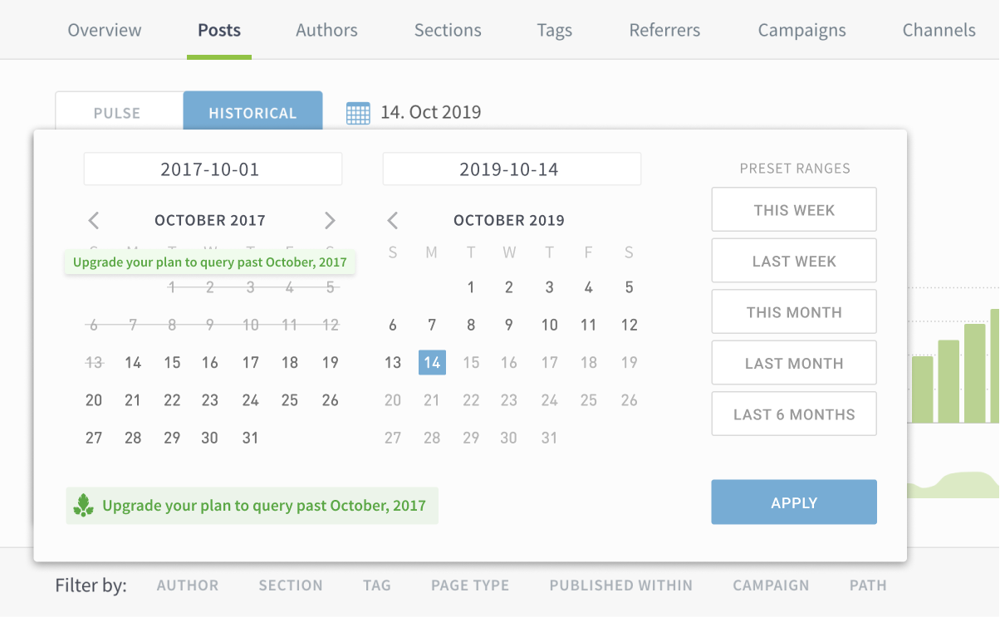

###### Option 2
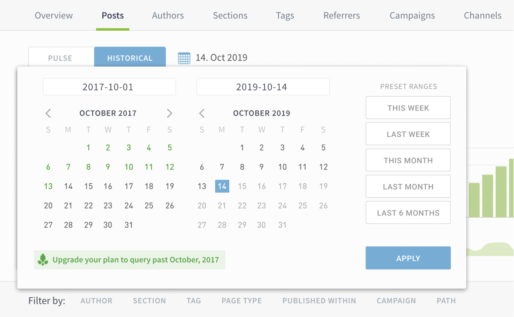

###### Option 3
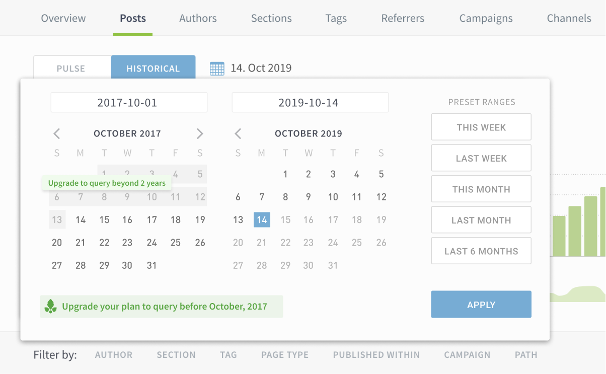

I struggled a bit with making both upgradable dates and dates outside the historical limit look friendly and enabled. I eventually settled on a version of **Option 3**, highlighting the dates in grey and leaving dates outside the historical start-date grey and unhighlighted.

#### Modal flows:

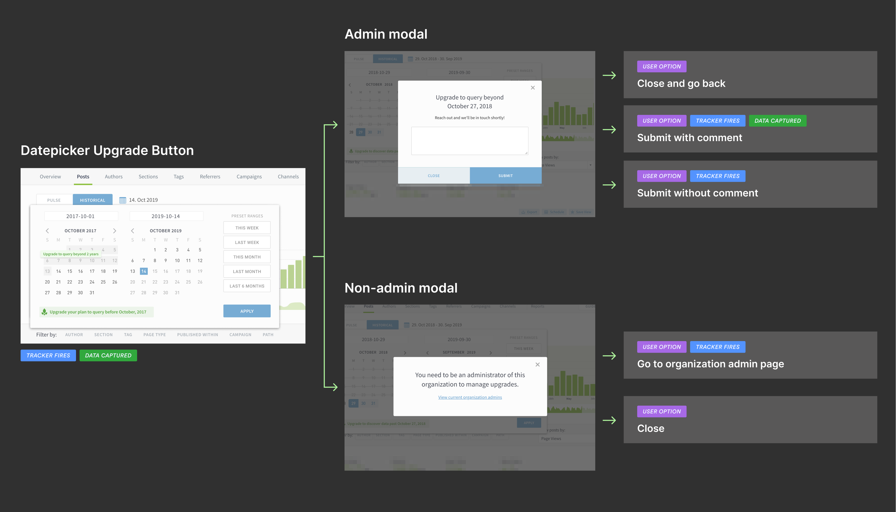

###### Admin users
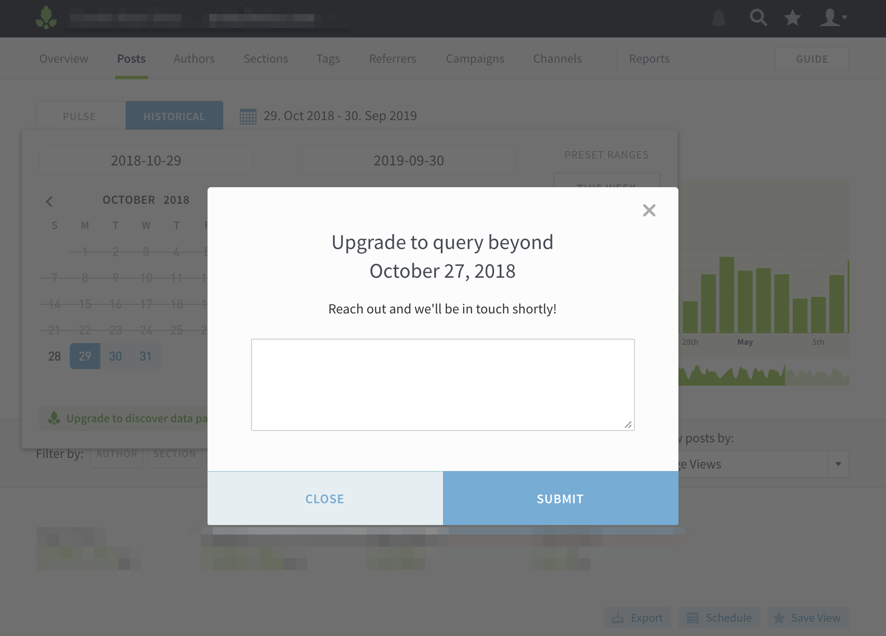

###### Non-admin users
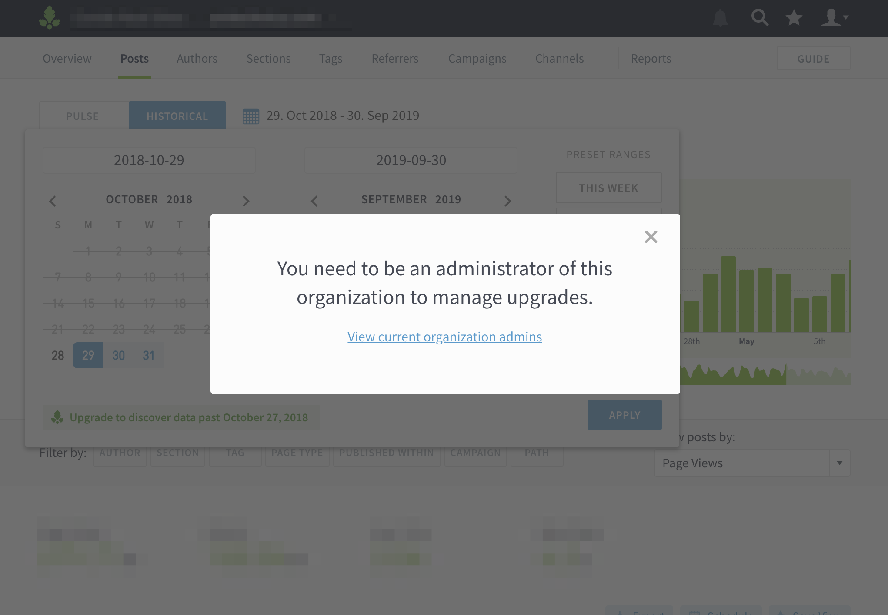

## Out-of-scope ideas to explore
- In-app self-serve Upgrades
- Create a screen in User Settings that displays all feature limits
- Rebuild calendar and datepicker components to allow for more flexible interactions and tracking
- Update modal components to allow for more flexible properties (functions, button text, inputs, placeholders)

## Determining success

This product update is still in its infancy, but let's review the original objectives:

- **Communicate to users if historical data exists outside their plan's retention limits**
    - ✅Yes, now there is a prominent spot in the interface that informs about available historical data
- **Allow users to upgrade their plans and data retention limits**
    - ✅Yes, now there is a prominent spot in the interface that informs
    about available historical data
    - ⏲️After some time, we will be able to see how these tracked data requests effect account upgrades
- **Prevent account churn**
    - ⏲️Check back later!