import videoMap from 'content/work/2019-11-25-currents/currents-map.mp4';
import Link from "components/_ui/Link/Link";

## Introducing [Currents](https://currents.parsely.com)

[Currents](https://currents.parsely.com) is a real-time and historical dashboard showcasing the relationship between content production and attention.

With Currents you can explore top performing topics, categories, stories, referrers, and more. You can also dive into content production data—what is being written about and when.

**About the data:**
Parse.ly's other analytics offering, [Parse.ly Analytics](https://parse.ly), measures content performance on thousands of websites. Currents aggregates and anonymizes those sites’ data to create a one-of-a-kind view of the relationship between content production and attention.

 

🚀

I want to start with a deep dive of an **Info Page** and its metrics, then get into the design and developmental processes. Let's go!

## Info Page deep dive

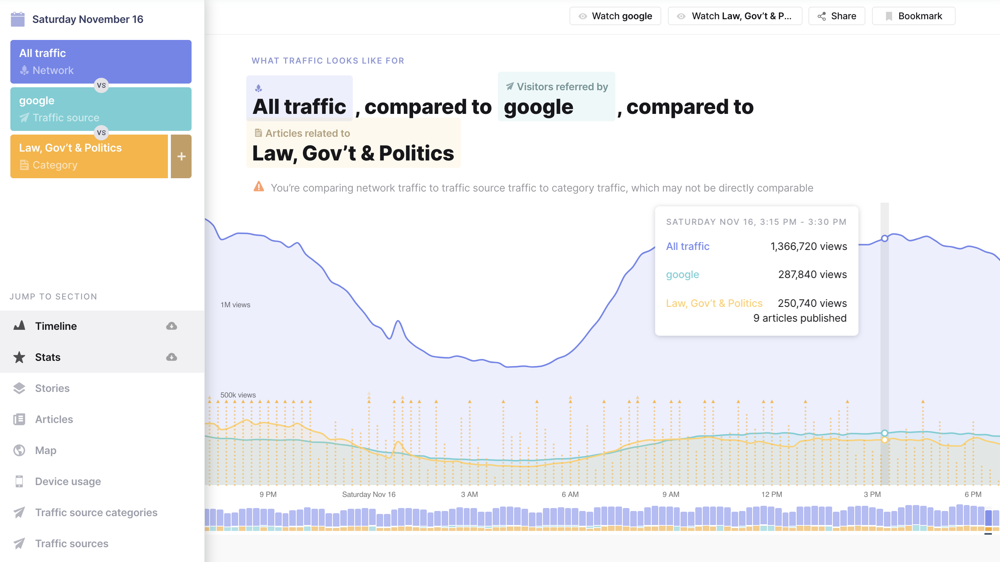

The Currents Info page is the bread-and-butter of this product. Inside this page you can create many types of data queries and explore numerous metrics.

### Search

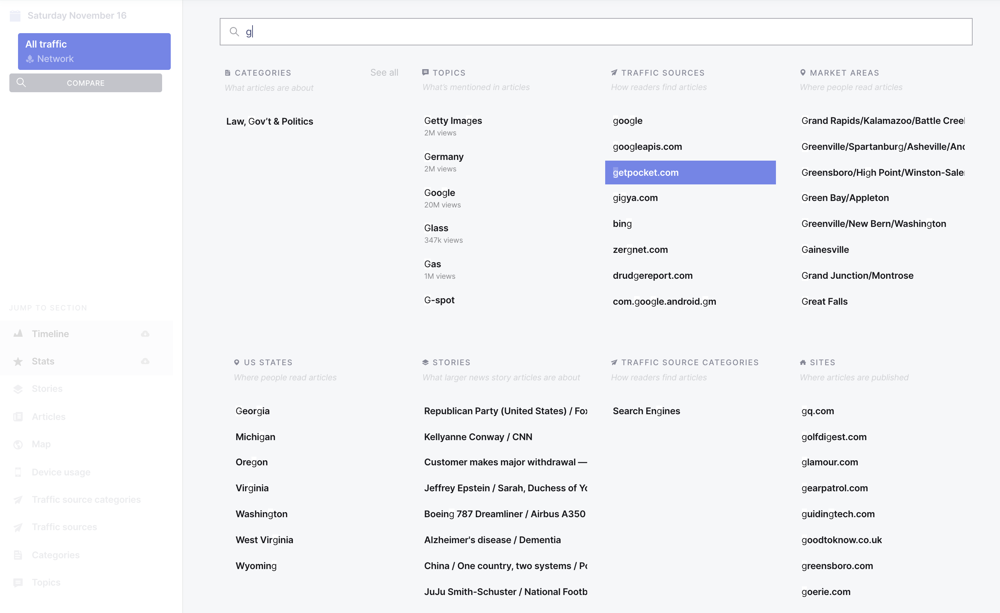

 

The Info Page search interface allows you to search multiple types of attention and content production data:

**Categories:**
What categories the article covers (eg. *business*, *sports*)

**Topics:**
What people, places, and things the article mentions (eg. *Obama*, *jalapeño*)

**Traffic sources:**
The site or app people used to discover the articles (eg *twitter*, *google*)

**Traffic source categories:**
The type of site, app, or method people used to discover articles (eg *search*, *social media*)

**Market areas:**
The location of people reading articles, based on [media markets](https://en.wikipedia.org/wiki/Media_market)

**US States:**
The U.S. state where people are reading articles

**Stories:**
The broad news story article groups are about

**Sites:**
What site the article was published on

**Site sizes:**
The size of the site the article was published on

 
 

A common use case is comparing referrer traffic: **Which platform is referring more visitors to articles&mdash;Facebook, Google, or Twitter?** This can help inform a content distribution plan.

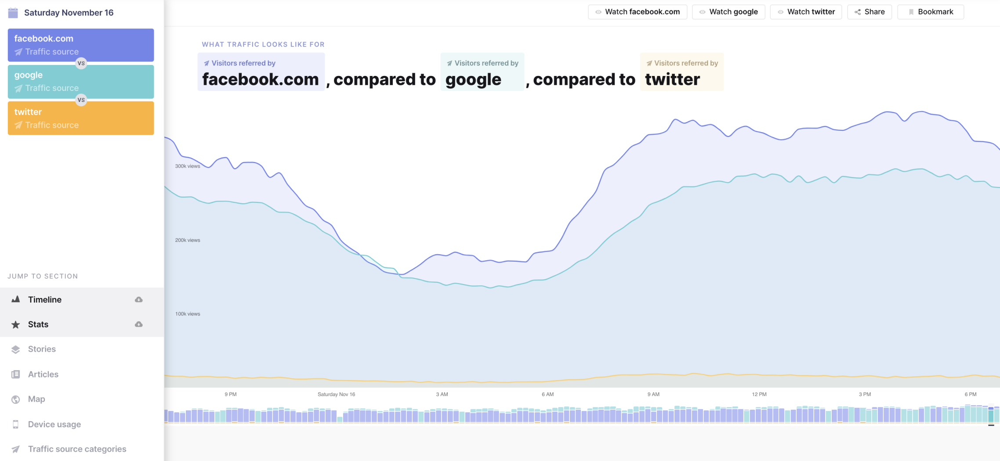

### Timeline

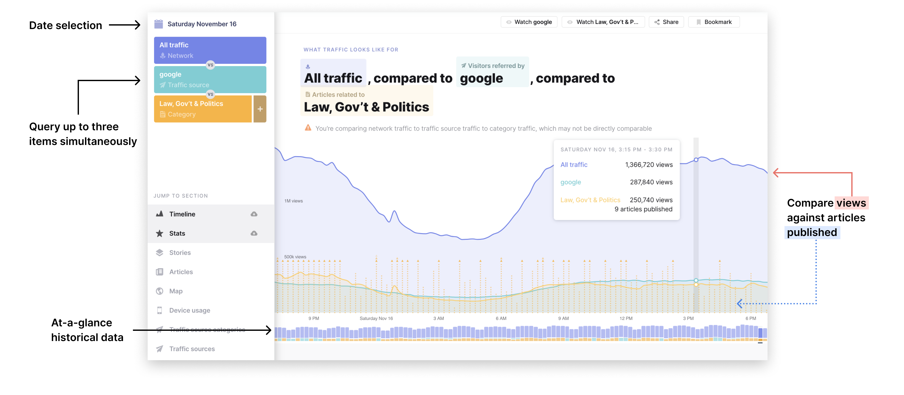

The timeline shows views over time, articles published over time, and historical trends. One of my favorite components is the query phrase above the timeline&mdash;it becomes increasingly helpful the more complex a query becomes.

### Query Stats

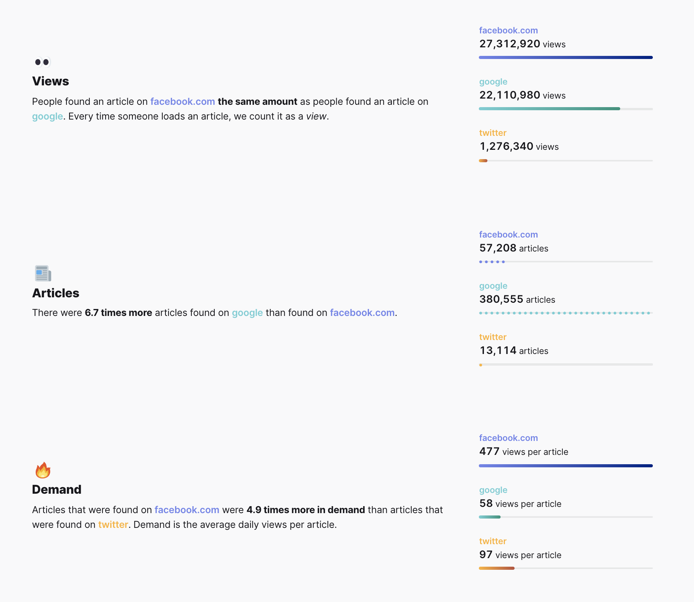

Query stats for query items are broken down into **views**, **articles**, and **demand** (the average number of views for each article).

Here we see that even though more total articles are referred by Google than by Facebook, articles are around 5x more in _demand_ for Facebook than for Twitter or Google.

Providing both the analysis phrase and the stacked bar charts gives users multiple ways to understand the information.

### Weekly and daily trends

See how query traffic compares against **all traffic** over days and weeks.

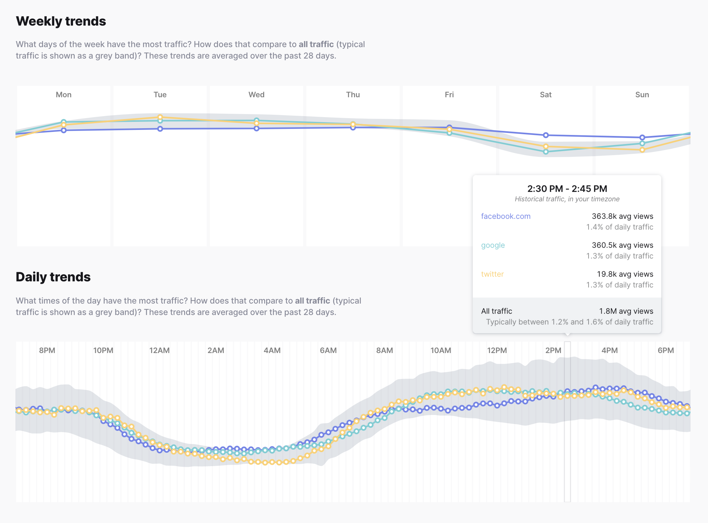

### Top stories and articles

Currents analyzes the full text of articles in to understand what they’re about. If there is enough data to quanitfy the existence of a story, story data will suface in this section. Articles that are about a single event or issue are grouped into a story. The name of a story comes from the topics most relevant to it.

Unfortunatley stories about Donald Trump are frequently in a Top Story spot. 🤬

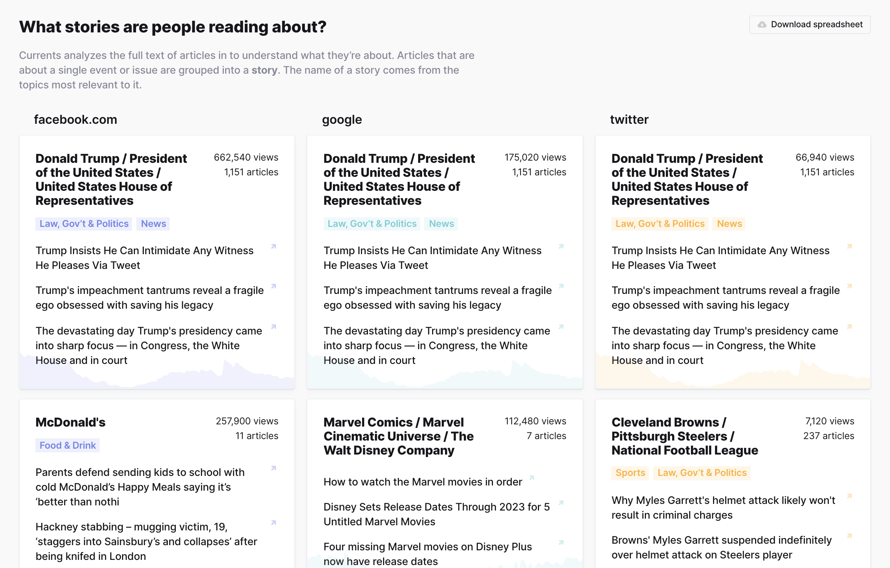

Currents also surfaces a random sampling of articles people are reading from the query's traffic data.

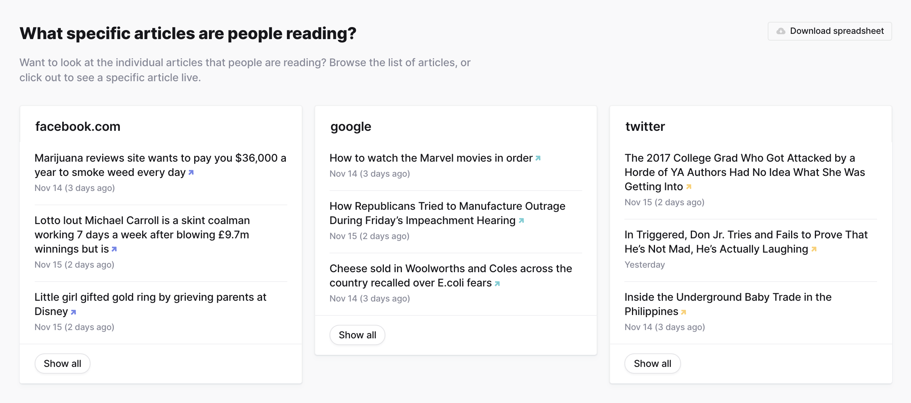

### Traffic locations

<!-- 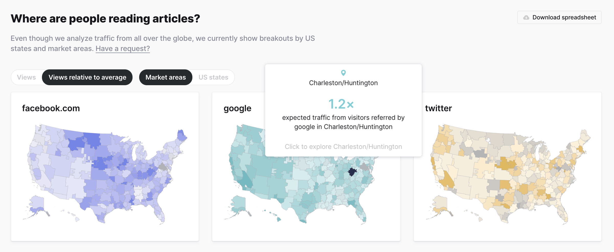 -->

    

        <video
        autoPlay loop muted playsInline
        poster="./currents-info-map.png"
        >
            <source src={videoMap} type="video/mp4" />
        </video>
    

Here you can dive into traffic based on US location. Originally we wanted to show full world maps, but we quickly learned that our dataset is skewed towards US and some European locations, so we decided to limit the filtering to US states and market areas.

In the map, you can view both total views and views relative to the average. Since California, Texas, and New York have large populations, these total views will always be high comparatively. To account for this, we allow users to view both raw view counts and relative views. This also allows us to show areas above and below the average amount.

### Device breakdown

###### See total views for mobile, tablet, and desktop devices, and compare against the total dataset averages
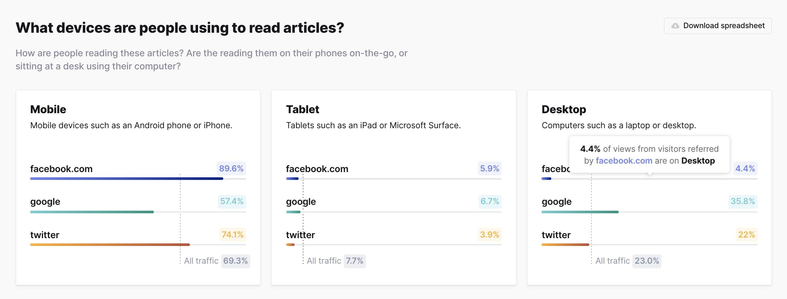

### Referrer breakdown

###### View top refererrs within referrer categories and compare against the total dataset averages
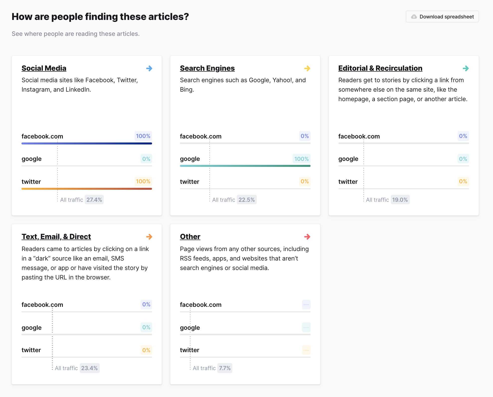

### Top topics and categories

###### View top topics and categories for each query item in addition to re-sorting by individual query item.
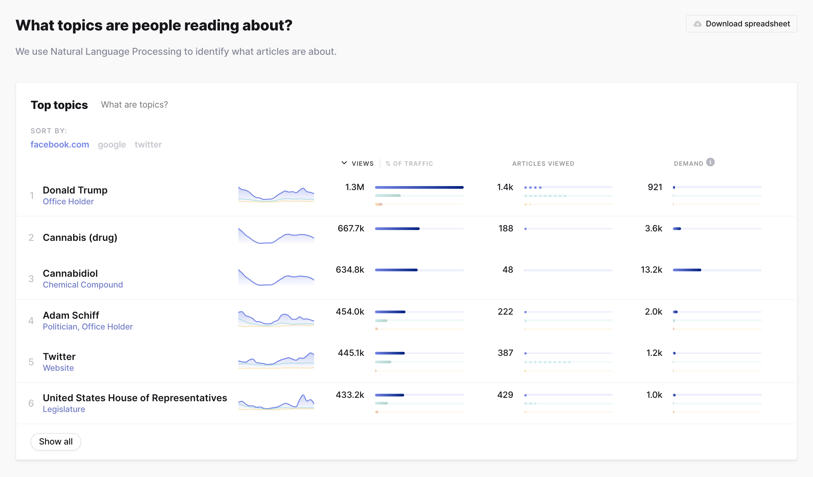

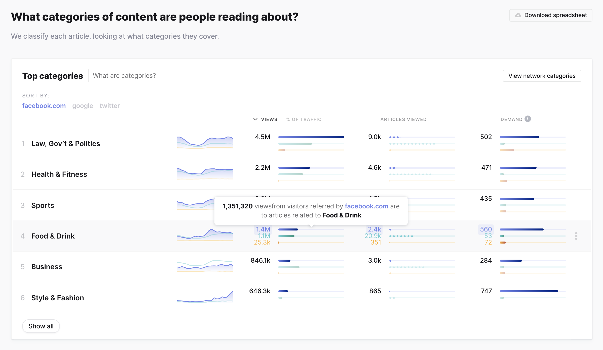

## Process

#### Sprint

In January 2018 when we began this project, we wanted to quickly verify a bunch of decisions while learning about the dataset we were exploring. We decided to have a modified four day Sprint.

The data was still being analyzed and aggregated at this point, but we operated as if we had access to many ways of querying and anlalyzing (sentiment anlysis, for example).

Over the course of four days, we conducted initial customer interviews, collaborated via Zoom, Miro (RealtimeBoard), Slack, and Keynote, pen and paper'd, and built a working prototype in Keynote. We then presented the dashboard to the original interviewees and conducted user interviews.

###### Miro board
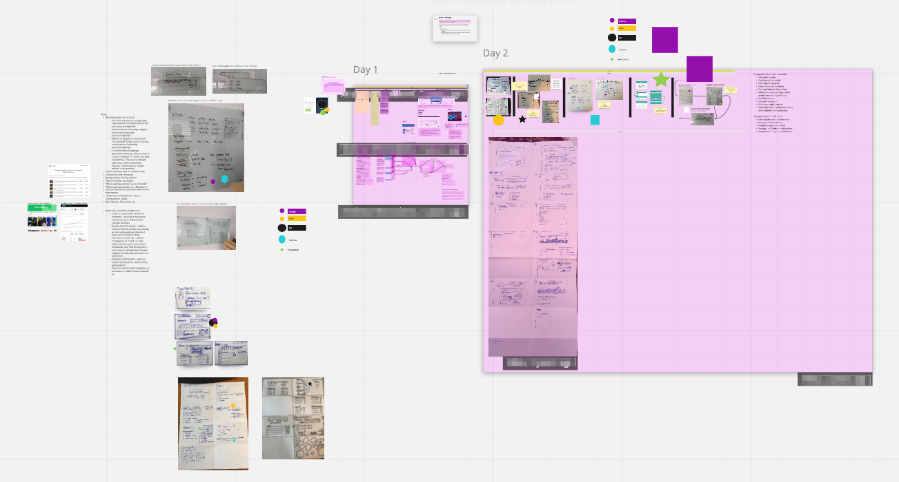

It was a whirlwind but incredibly exciting.

#### User interviews

We worked to ship an MVP product from January to June. During this time we continued to perform user intereviews, both for pure information gathering sessions and to have folks walk through interface protptypes.

The interviews would quickly let us know if we were on the right track with a component or way off the mark. For example, initial iterations of the Stats section listed each query out horizontally in a card. While this was a great way to view the information for individual queries, we noticed users had trouble comparing the information across query items, thus defeating the point of having complex queries!

###### Early prototype of Info Stats
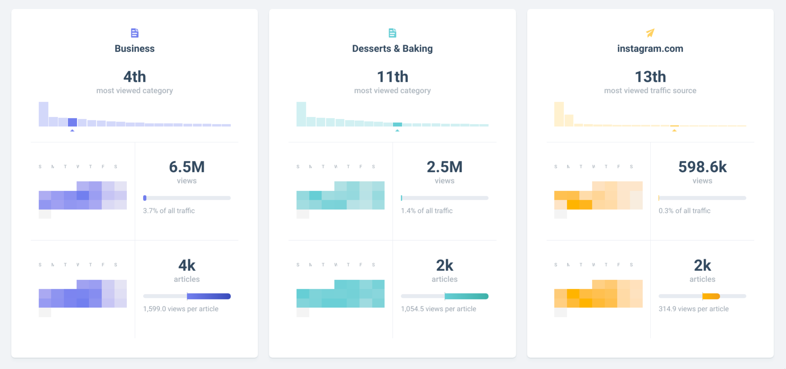

We also couldn't rely on always having enough historical data into any given page query, so we opted to nix the heatmap.

#### Rapid mockups and prototpyes
I worked very closely with the Project Lead and Senior Frontend Engineer, Amelia Wattenberger, to collaborate on designs, layout, UI library, UX flows, the codebase (this was my introduction to a React codebase!), and to continuously work through what problems the data could answer.

**A common flow for us:**
- Brainstorm on what ways we could slice and query the data to answer a question
- Create static mockups or prototype ideas in the code (or both) to see what a solution could look like (prototyping an initial version in the codebase was essential since would be able to work with real data samples)
- Present to the team and gather feedback
- Either polish and push to our staging platform for other company members to use or go back to the drawing board with the team feeback

#### Analyzing user behavior

After we launched, we utilized [Mixpanel](https://mixpanel.com/home) to analyze the behavior of our new users. This let us dig into the various user flows, types of queries searched, and other custom events.

###### Mixpanel custom event timeline
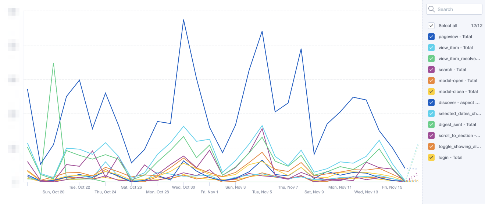

<!-- #### Experiment with feature limits -->

## Use cases for Currents data

- **Publishing**
    - Know what topic or category to write about
    - Benchmark their own content
- **Agencies & PR**
    - Help with client relationships
    - Understand current media trends
- **Entertainment**
    - Key into emerging artists
    - Keep an eye on client PR
    - Inform marketing decisions
    - Validate marketing decisions
- **Marketing**
    - Inform marketing decisions
    - Validate marketing decisions

 

This list keeps growing as we continue to work with the data and talk to users.

<!-- ## Currents use cases

🚀 Know what topic or category to write about

 

🚀 Plan channel distribution strategies

 

🚀 Understand where engagement occurs (not just article shares) -->

## Conclusion

This ongoing project has been incredibly rewarding to be a part of&mdash;from working with the new data and building a completely new dashboard from scratch to collaborating with my amazingly talented teammates and getting to learn _a lot_ during the process.

Please check out Currents for yourself! I have only covered the tip of the iceberg.

    <Link isButton buttonProps={{ size: "xl" }} to="https://currents.parsely.com/discover?from=2019-11-16&to=2019-11-16">
        Go to Currents Discover
    </Link>

    <Link isButton buttonProps={{ size: "xl", color: "white-blue-stroke" }} to="https://currents.parsely.com">
        Go to Currents homepage
    </Link>

 

#### Happy exploring!

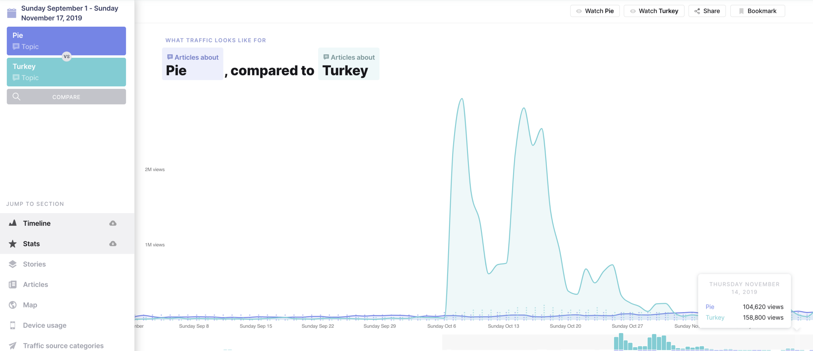

<!-- ## First iterations

###### Where we started
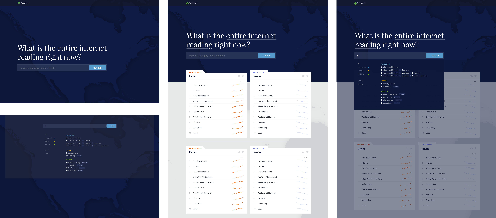

###### Note: This was the week Donald Trump spewed the word "shithole".
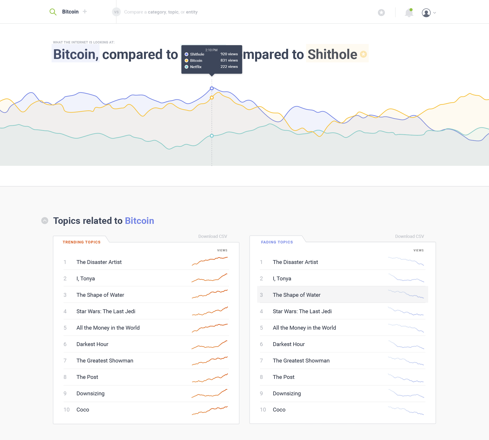

###### Eary search menu mockups
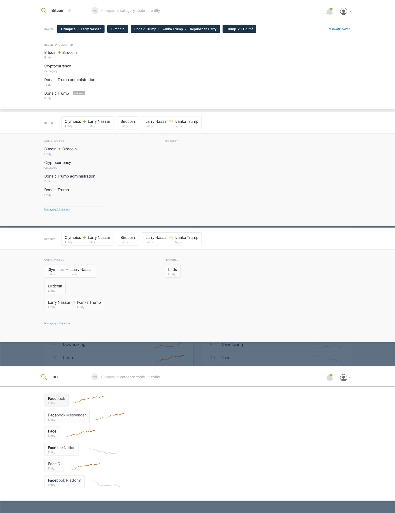

#### Explore random data components -->

<!-- ## Component explorations -->